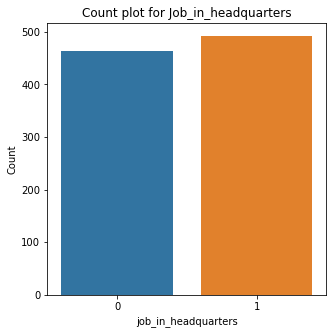
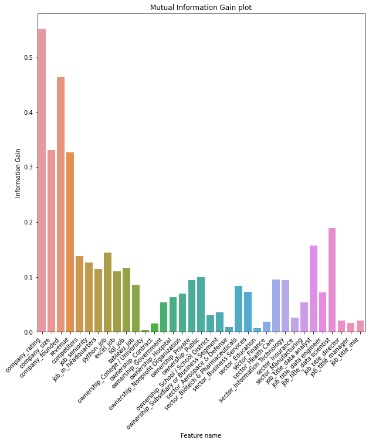
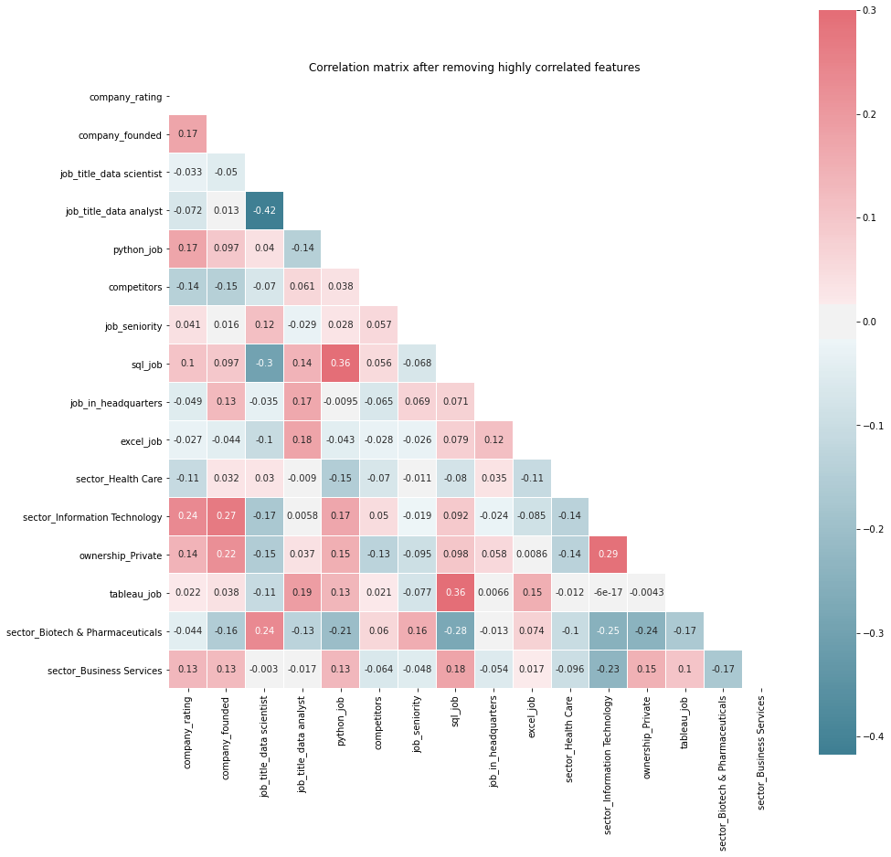
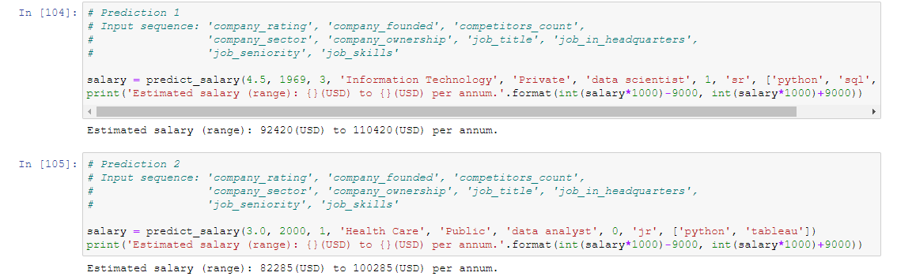

# Data Scientist's Salary prediction <h1> 
   
  
### Project Overview

* Created a machine learning model that **estimates salary of data scientist based on the features like rating, company_founded, etc.**
* Engineered features from the text of each job description to quantify the value companies put on python, excel, tableau and sql

### How will this project will help?

* This project helps data scientist/analyst to negotiate their income for an existing or a new job

### Resources Used

* Packages: **pandas, numpy, sklearn, matplotlib, seaborn.**
* Dataset by Ken Jee: https://github.com/PlayingNumbers/ds_salary_proj

### Exploratory Data Analysis & Data Cleaning

* **Removed unwanted columns:** 'Unnamed: 0'
* **Plotted bargraphs and countplots** for numerical and categorical features respectively
* **Numerical Features** (Rating, Founded): **Replaced NaN or -1 values with mean or meadian based on their distribution**

 

* **Categorical Features: Replaced NaN or -1 values with 'Other'/'Unknown' category**
* **Removed unwanted alphabet/special characters from Salary feature**
* **Converted the Salary column into one scale** i.e from (per hour, per annum, employer provided salary) to (per annum)

### Feature Engineering
* **Creating new features** from existing features e.g. **job_in_headquaters from (job_location, headquarters),** etc.

* Trimming columns i.e. **Trimming features having more than 10 categories to reduce the dimensionality**
* **Handling ordinal and nominal categorical features** 

* Feature Scaling using **StandardScalar**
### Model building & Evaluation

Metric: Negative Root Mean Squared Error (NRMSE)
* Multiple Linear Regression: -27.523
* Lasso Regression: -29.094
* **Random Forest: -18.343**
* Gradient Boosting: -25.059
* Voting (Random Forest + Gradient Boosting): -19.723
**Note: Evaluations scores are obtained using cross validation.**

### Model Prediction
 
