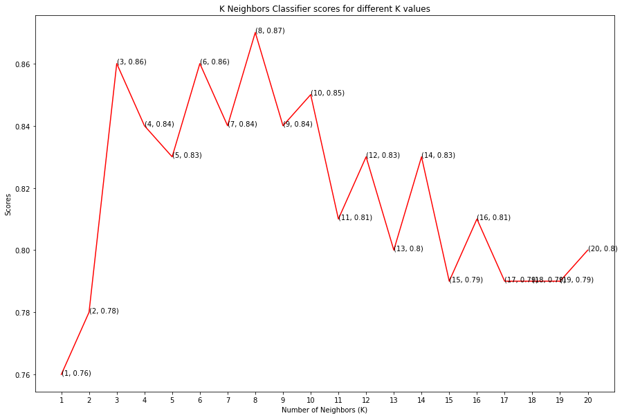
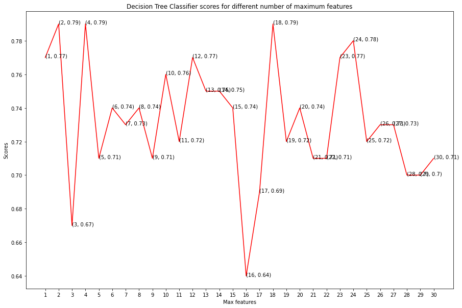

# Heart Disease Prediction <h1> 
  
  
### Project Overview
Classifying whether a person is suffering from Heart Disease or not.

### Resources Used

* Packages: **pandas, numpy, sklearn, matplotlib, seaborn.**
* Dataset by Ken Jee: https://www.kaggle.com/ronitf/heart-disease-uci

### Exploratory Data Analysis 
* Plotted heatmap to visualise the correlation between the features of the dataset
* Plotting histograms for the entire dataset
* Visualise the balance of the dataset

### Feature Engineering

* Categorical variables into dummy variables
* Scale dataset with StandardScaler

### Model building & Evaluation
* **K Neighbors Classifier: 87%**
* Decision Tree Classifier: 79%
* Random Forest Classifier: 84%

 
 

